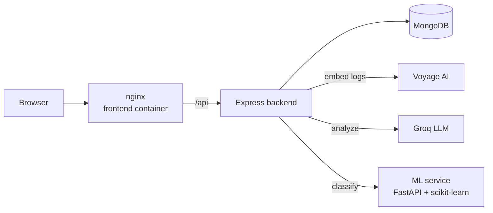
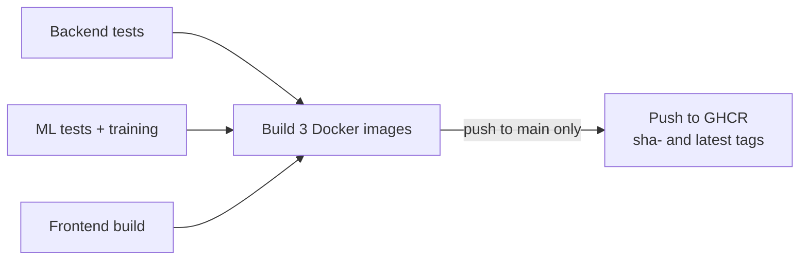

# AI DevOps Incident Assistant

Paste application or Docker logs (plus optional CPU / memory / request-count /
error-rate metrics) and get back a structured incident analysis: summary, likely
root cause, supporting evidence, severity, troubleshooting steps and a confidence
score. Past analyses are stored and browsable.

Each analysis combines three independent signals:

1. **RAG retrieval** - the logs are embedded and matched against a runbook of 13
   known incident patterns.
2. **LLM analysis** - the logs, metrics and matched runbook steps go to an LLM,
   which returns validated structured JSON, so the suggested steps cite
   documented procedures.
3. **Our own trained classifier** - a Python service predicts the incident
   category in milliseconds, with no API cost. The UI shows whether it agrees
   with retrieval; disagreements are the incidents most worth a second look.

## Stack

| Layer | Choice |
|---|---|
| Frontend | React 19 + Vite, served by nginx |
| Backend | Node.js 22 + Express 5 (ESM), Zod validation |
| Database | MongoDB + Mongoose |
| LLM | Groq (`openai/gpt-oss-120b`) |
| Embeddings | Voyage AI (`voyage-4-lite`) |
| ML service | Python 3.12, scikit-learn (TF-IDF + Logistic Regression), FastAPI |
| Infra | Docker + Docker Compose |
| CI/CD | GitHub Actions |

## Architecture



The ML service is **optional**: if it is down or unsure, the analysis still
completes, just without the predicted category. Retrieval and the LLM are
required.

## Structure

```
backend/    Express API - retrieval, LLM analysis, classifier client, persistence
frontend/   React dashboard - analyze, history and incident pages
ml/         Python classifier - data preparation, training, FastAPI service, tests
docker/     Dockerfiles + nginx config
.github/    CI/CD workflow
```

## Running with Docker Compose

Needs Docker and API keys for Voyage and Groq.

```bash
cp backend/.env.example backend/.env    # fill in VOYAGE_API_KEY and GROQ_API_KEY
docker compose up --build
```

| URL | What |
|---|---|
| http://localhost:8080 | The app |
| http://localhost:5000/api/health | Backend health (503 if the database is down) |
| http://localhost:8000/docs | ML service API docs |

Compose runs its own MongoDB with a named volume, and overrides `MONGO_URI` and
`ML_SERVICE_URL` from `.env` to point at the containers - so the same `.env`
works for local development too. `docker compose down -v` also deletes the data.

## Running locally (without Docker)

**Backend** - http://localhost:5000

```bash
cd backend
cp .env.example .env     # fill in MONGO_URI (e.g. MongoDB Atlas) and the API keys
npm install
npm run dev
```

**Frontend** - http://localhost:5173 (proxies `/api` to the backend)

```bash
cd frontend
npm install
npm run dev
```

**ML service** - http://localhost:8000 (optional)

```bash
cd ml
python -m venv .venv
.venv/Scripts/activate            # Windows; on macOS/Linux: source .venv/bin/activate
pip install -r requirements.txt
python train.py                   # writes model.joblib (~1 minute)
uvicorn main:app --reload --port 8000
```

## Tests

```bash
cd backend && npm test                                    # Node test runner, fakes for Voyage/Groq, in-memory MongoDB
cd ml && python -m unittest discover -s tests -t . -v    # fake model, no training needed
```

No API keys are needed to run the tests.

## CI



[`ci-cd.yml`](.github/workflows/ci-cd.yml) runs on every push and pull request:
backend tests, ML tests plus a full training run, and a frontend build run in
parallel. Only if all three pass are the backend, frontend and ML images built,
so a pull request also proves the Dockerfiles still work. For a push to `main`
the images are pushed to GitHub Container Registry, tagged with the commit
(`sha-abc1234`) and `latest`.

Deployment is out of scope: the pipeline stops at tested, ready-to-run images.

## The ML classifier

### Categories

13 incident categories, each with a runbook entry in
[`backend/src/knowledge/runbook.js`](backend/src/knowledge/runbook.js):

`oom-killed`, `db-connection-refused`, `disk-full`, `port-in-use`, `crash-loop`,
`ssl-cert-expired`, `high-latency`, `error-rate-spike`, `dns-resolution-failure`,
`permission-denied`, `missing-config`, `too-many-open-files`, `auth-brute-force`

A category names the **root cause**, not the symptom: a crash loop caused by a
missing environment variable is `missing-config`. A test checks that every
category exists in the training data, the runbook and the frontend.

### Data

| Source | Rows | Notes |
|---|---|---|
| [`ml/data/incidents.jsonl`](ml/data/incidents.jsonl) | 576 | Hand-written, ~40 per category (60 for the four hardest), varied across Node, Python, Go, Java, nginx, Docker, Kubernetes |
| [`ml/data/loghub_incidents.jsonl`](ml/data/loghub_incidents.jsonl) | 80 | **Real** incidents from [Loghub](https://github.com/logpai/loghub): 40 kernel OOM kills (Linux) and 40 SSH brute-force attacks |
| [`ml/data/noise_lines.txt`](ml/data/noise_lines.txt) | 1,764 lines | Real healthy log lines from Loghub Apache, Linux and SSH logs, with every line mentioning any category filtered out |
| [`ml/data/noise_lines_modern.txt`](ml/data/noise_lines_modern.txt) | 160 lines | Hand-written healthy lines from today's stacks (Spring Boot, Node, Vite, nginx, Mongo, Postgres, Redis, Docker, Kubernetes, FastAPI, CI), filtered the same way - a test enforces it |
| [`ml/data/real_eval.jsonl`](ml/data/real_eval.jsonl) | 44 | **Evaluation only, never trained on.** Log snippets copied verbatim from public GitHub issues, each with its source URL: 38 incidents across 12 categories and 6 healthy startup logs |

The Loghub files are distilled once by `prepare_loghub.py` (raw logs go in
`ml/data/loghub/`, gitignored). Only the small outputs are committed, so training
and the Docker build never need the ~80MB raw files.

### Training

[`augment.py`](ml/augment.py) buries each incident among real noise lines (3 noisy
copies per incident) and generates an `unknown` class of healthy logs.
[`train.py`](ml/train.py) evaluates with **5-fold cross-validation only**: five
models, each tested on a different fifth of the incidents, with every report
(per-category precision/recall, accuracy by kind of log, confusion matrix)
pooled across all five. Each fold **splits before augmenting**, so noisy copies
of one incident never land on both sides. The shipped model is then trained on
all the data - 6 models per run in total.

Classifying a whole log as one bag of words let a few error lines be diluted by
dozens of normal ones. [`predict.py`](ml/predict.py) instead scores every 3-line
window and keeps the strongest incident signal, answering "no prediction" when
nothing reaches 40% confidence. Training and the API both use this file, so the
reported accuracy is the accuracy served.

Before vectorizing, `normalize()` lower-cases the log, drops timestamp and
hostname prefixes, masks IPs, and masks numbers **except** meaningful codes
(`137`/`139`/`143` exit codes, `401`/`403`/`404`/`429`/`5xx` HTTP statuses).
Any duration of a second or more (`8400ms`, `9.1s`, `60 seconds`) becomes the
word `slowduration`, so a slow request no longer looks like a fast one.

### Results

**Windowing** (v2.0, held-out test set on the original 576 incidents):

| Kind of log | Whole-log model | Windowed model |
|---|---|---|
| Error buried in noise | 46% | **69%** |
| Healthy log → no prediction | 53% | **86%** |
| Clean error snippet | 83% | 78% |
| 5-fold cross-validation | 56% | **70%** |

**Accuracy fixes** (v2.1 and v2.2, shipped). Each change measured on its own
with the same 5 cross-validation folds - a single test split was misleading
here, because adding data changes which incidents land in the test set:

| | CV accuracy | crash-loop | dns | missing-config | high-latency | healthy |
|---|---|---|---|---|---|---|
| v2.0 | 70.2% | 0.51 | 0.74 | 0.53 | - | 0.91 |
| + keep meaningful numbers, drop hostnames | 72.3% | 0.52 | 0.74 | 0.57 | - | 0.91 |
| + 60 examples for 3 weak classes, 2 mislabels fixed (v2.1) | 75.6% | 0.75 | 0.85 | 0.78 | 0.45 | 0.83 |
| + `slowduration` token | 76.0% | 0.75 | - | - | 0.57 | 0.83 |
| + 20 high-latency examples (v2.2) | **77.2%** | 0.72 | 0.82 | 0.79 | **0.83** | 0.88 |
| + 160 modern healthy lines in the noise pool (v2.3) | 75.6% | 0.75 | 0.82 | 0.76 | 0.77 | 0.81 |

v2.3 is the one version whose CV accuracy went **down** on purpose. Burying
incidents in modern application logs instead of 2005 syslog is simply a harder
test - and on real logs it is the biggest improvement so far (healthy logs left
alone: 3/6 to 5/6, incidents still 38/38). The old 77.2% was measuring an
easier problem.

**Real logs** ([`real_eval.jsonl`](ml/data/real_eval.jsonl), printed at the end
of every `train.py` run):

| | Real incidents categorised correctly | Real healthy logs left alone |
|---|---|---|
| v2.0 | 38/38 | 5/6 |
| v2.1 | 38/38 | 4/6 |
| v2.2 | 38/38 | 3/6 |
| v2.3 | 38/38 | **5/6** |

Read these honestly. The incidents were found by searching GitHub for their
error text (`EADDRINUSE`, `ENOTFOUND`, ...), so they are textbook cases - too
easy to tell versions apart. The healthy logs are the useful part, and they
disagree with cross-validation: CV says false alarms went down in v2.2, real
startup logs say up. CV's healthy logs are built from 2005-era Loghub lines;
these are modern Spring Boot and Uvicorn logs, which the model has never seen
as healthy. `Started App in 4.083 seconds` now reads as `slowduration` and gets
called `high-latency`. With 6 logs each miss is 17%, so this is a warning sign,
not a measurement - but it points at the real weakness. The set also caught a
bug: a `kubectl get pods` table's AGE column (`24h`) was read as a slow
duration, fixed before shipping.

The hostname fix mattered beyond the score: the top features for `unknown` were
the noise server's hostname (`combo`) and month names - the model was partly
learning "this server means healthy". They are now ordinary log words, and
`137` is a top feature for `oom-killed`.

When the model is wrong it mostly returns *no prediction* rather than a wrong
category: precision is 0.8-1.0 for most categories.

### Known limitations

- 11 of 13 categories rely on hand-written examples; only `oom-killed` and
  `auth-brute-force` have real data. Accuracy on real production logs will be
  lower than the numbers above.
- A healthy log that merely *mentions* a category's vocabulary still trips the
  model: the one real startup log it still flags is a Spring Boot log whose
  Tomcat line says `TLS virtual host ... certificate`, and it reads that as
  `ssl-cert-expired`. The noise pool cannot teach the difference, because every
  noise line containing category vocabulary is filtered out by design.
- `db-connection-refused` (0.59) and `error-rate-spike` (0.62) have the lowest
  recall in cross-validation - the next categories needing more examples.
- The real-log incident set is keyword-selected and too easy; it has no
  `error-rate-spike` logs, because a spike of 5xx responses across many
  requests is rarely pasted into a GitHub issue.

## Build progress

- [x] Step 1 - Express server, health check, central error handling
- [x] Step 2 - MongoDB connection + Incident model
- [x] Step 3 - Runbook knowledge base + embeddings + retrieval (RAG)
- [x] Step 4 - Analysis service (LLM)
- [x] Step 5 - Incident routes, controller, validation
- [x] Step 6 - Tests
- [x] Step 7 - React frontend
- [x] ML classifier service - data, training, windowed prediction, tests
- [x] Step 8 - Docker + Compose
- [x] Step 9 - GitHub Actions CI (tests, frontend build, Docker image build and push)
